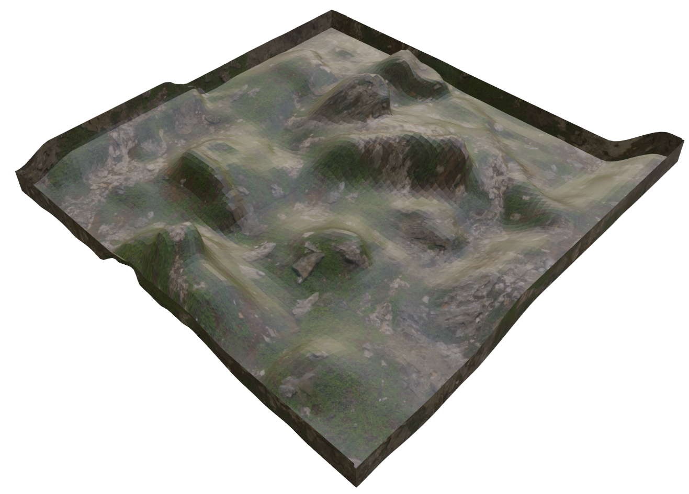
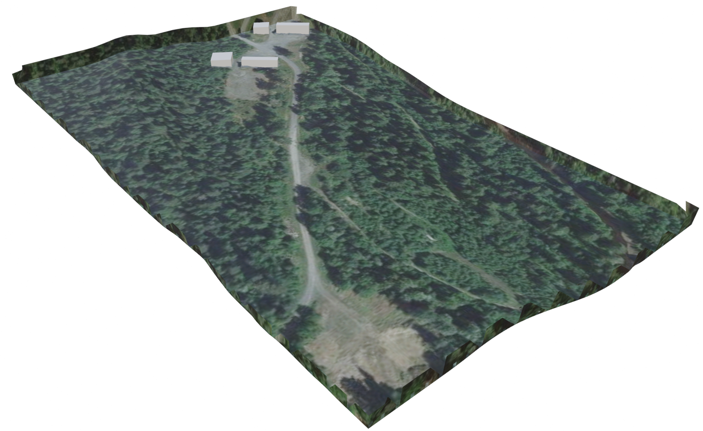
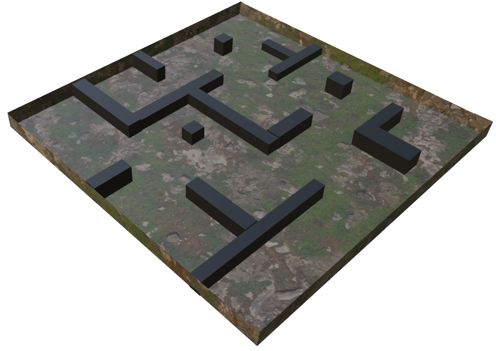
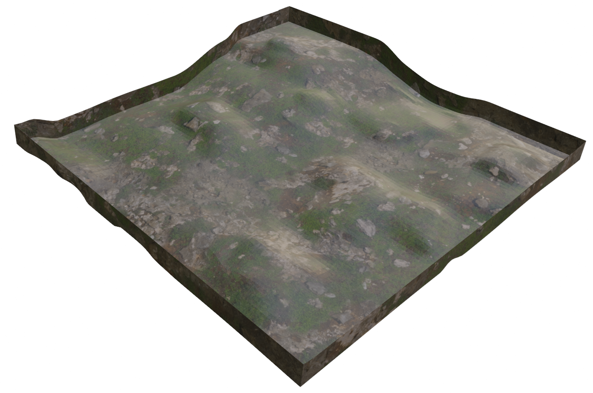
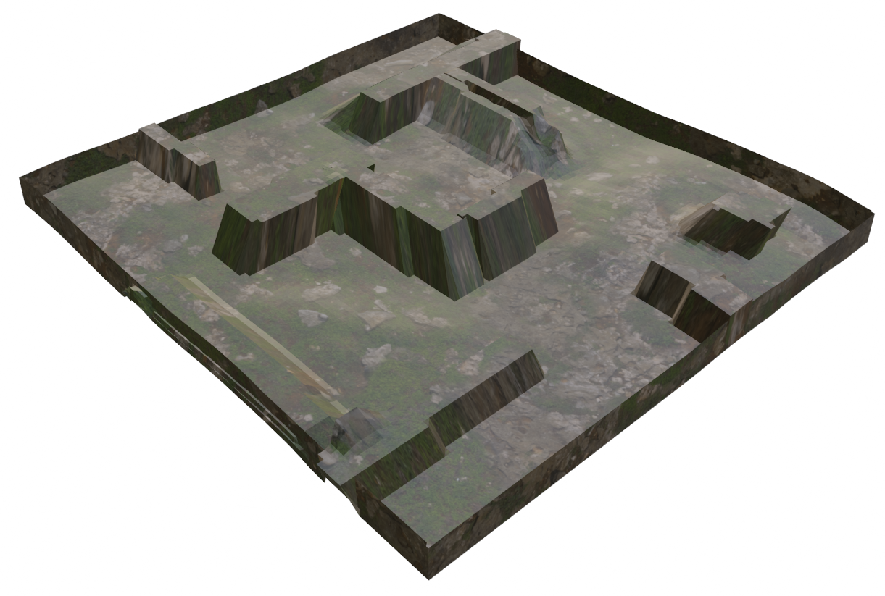

# Path planning simulation for an ATV in a terrain based enviroment uisng GBPlanner2

This project is based on [GBPlanner2](https://github.com/ntnu-arl/gbplanner_ros) from ntnu-arl, together with a 
new simulator utilizing a atv model taken from [sigirdmellomseter/lonewolf](https://github.com/sigridmellemseter/lonewolf)

Please refer to the GBPlanner2 [wiki](https://github.com/ntnu-arl/gbplanner_ros/wiki) for documentation of the planner interface and parameters.

## Installation
These instructions assume that ROS desktop-full of the appropriate ROS distro is installed.

Install necessary libraries:

ROS Noetic:
```bash

sudo apt install python3-catkin-tools \
libgoogle-glog-dev \
ros-noetic-joy \
ros-noetic-twist-mux \
ros-noetic-interactive-marker-twist-server \
ros-noetic-octomap-ros
```

Clone and update the required packages:
(make sure to bee in the root project folder: <path_to_lonewolf> )
```bash
wstool init
wstool merge dependecies_ssh.rosinstall
wstool update
```

Build:
```bash
catkin config -DCMAKE_BUILD_TYPE=Release
catkin build
```

### Simulator

There are made five worlds that can be simulated in:







To run the simulator simly use the command:

```bash
roslaunch lonewolf_sim gbplanner.launch
```
This will run the simulator in the default world; maze_world.world. It is possible to spesify one of the other worlds when running the simulator with the world argument:

```bash
roslaunch lonewolf_sim gbplanner.launch world:="other_world_name.world"
```

### GBPlanners smb_sim
GBPlanners orignonal simulator can be run with the follorwing command:
```
roslaunch gbplanner smb_sim.launch

```


## References

If you use this work in your research, please cite the following publications:

**Graph-based subterranean exploration path planning using aerial and legged robots**
```
@article{dang2020graph,
  title={Graph-based subterranean exploration path planning using aerial and legged robots},
  author={Dang, Tung and Tranzatto, Marco and Khattak, Shehryar and Mascarich, Frank and Alexis, Kostas and Hutter, Marco},
  journal={Journal of Field Robotics},
  volume = {37},
  number = {8},
  pages = {1363-1388},  
  year={2020},
  note={Wiley Online Library}
}
```
**Autonomous Teamed Exploration of Subterranean Environments using Legged and Aerial Robots**
```
@INPROCEEDINGS{9812401,
  author={Kulkarni, Mihir and Dharmadhikari, Mihir and Tranzatto, Marco and Zimmermann, Samuel and Reijgwart, Victor and De Petris, Paolo and Nguyen, Huan and Khedekar, Nikhil and Papachristos, Christos and Ott, Lionel and Siegwart, Roland and Hutter, Marco and Alexis, Kostas},
  booktitle={2022 International Conference on Robotics and Automation (ICRA)}, 
  title={Autonomous Teamed Exploration of Subterranean Environments using Legged and Aerial Robots}, 
  year={2022},
  volume={},
  number={},
  pages={3306-3313},
  doi={10.1109/ICRA46639.2022.9812401}}
```
